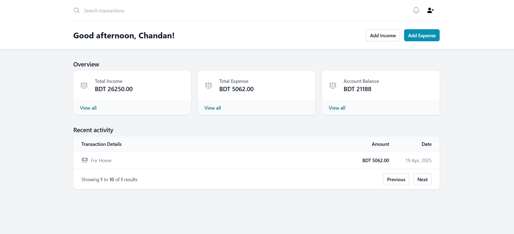

## MoneyMint

MoneyMint is a simple app for tracking expenses, budgeting, and getting an overview of your personal finance.

  

## Tech used

- [Laravel](https://laravel.com)
- [PHP](https://www.php.net)
- [MySQL](https://www.mysql.com)
- [Tailwind CSS](https://tailwindcss.com)

## How to run

Follow the instructions

- Clone the repository
- Run `composer install`
- Run `npm install && npm run dev`
- Copy the `.env.example` file to `.env` and configure your database
- Run `php artisan key:generate` to generate the application key
- Run `php artisan migrate --seed` to create the database tables and seed the database
- Run `php artisan serve` to start the server and access the application

## Caution

This project is intended for experiment.

## Contribution

Ideas and contributions are welcome! 🙌
